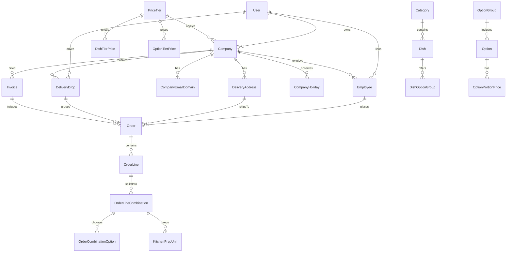

# Fernleaf Kitchen Operations Admin Panel

A full-stack commercial kitchen operations admin panel built for **Fernleaf Kitchen**. It powers corporate meal program operations, including catalogue management, derived price tiers, company-specific menu visibility, employee order placement, historical price snapshotting, kitchen station prep unit management, drop dispatch grouping, mobile driver delivery completion, and corporate invoicing.

---

## Mandatory Credentials & Live Accounts

Use these exact credentials to test the role-enforced features:

| Role | Email | Password | Allowed Scope |
| :--- | :--- | :--- | :--- |
| **Admin** | `admin@test.com` | `Test@1234` | Full access to catalogue, pricing tiers, companies, employees, orders, kitchen, dispatch, billing, and settings. |
| **Kitchen** | `kitchen@test.com` | `Test@1234` | Kitchen Board access only (mark prep units STARTED / DONE, filter by station). |
| **Dispatch** | `dispatch@test.com` | `Test@1234` | Dispatch Board access only (group drops, assign drivers, update drop status). |
| **Driver** | `driver@test.com` | `Test@1234` | Driver Mobile View only (view assigned drops for today, complete deliveries with notes & photos). |

---

## Local Setup Instructions

### Prerequisites
- **Node.js**: v18+ or v20+
- **npm**: v9+ or v10+

### Installation & Initialization

1. **Clone repository & install dependencies**:
   ```bash
   git clone <repo-url>
   cd fernleaf-kitchen-ops
   npm install
   ```

2. **Database Setup & Seeding**:
   The API project uses Prisma ORM configured with zero-dependency SQLite for instant out-of-the-box local testing (or PostgreSQL environment variable override).
   ```bash
   # Generate Prisma Client
   npm run prisma:generate

   # Push schema to database
   npm run prisma:migrate

   # Seed realistic persistent demo data and mandatory accounts
   npm run prisma:seed
   ```

3. **Running the Application**:
   - **Start Backend REST API** (runs on `http://localhost:3001`):
     ```bash
     npm run dev:api
     ```
   - **Start Frontend Next.js Admin Panel** (runs on `http://localhost:3000`):
     ```bash
     npm run dev:web
     ```

4. **Running Unit & Integration Tests**:
   ```bash
   npm run test:api
   ```

---

## Architecture Overview & Data Model Diagram



---

## Key Decisions & Trade-offs

1. **Monetary Integrity (Zero Floating-Point Error)**:
   - All prices, costs, line totals, order totals, and invoice totals are calculated and stored in **integer cents** (`Int`).
   - Prices round UP to the next 5-cent boundary (`$2.11 -> $2.15`).

2. **Server-Side Enforcement & RBAC**:
   - NestJS `@Roles()` decorator and `RolesGuard` strictly enforce role-based permissions on every endpoint.
   - Business rules (cut-off locks, combination option validity, zero-price dish hiding, pricing derivation) execute strictly in NestJS services, never bypassed by Next.js server actions.

3. **Historical Price & Item Snapshotting**:
   - Order lines and combinations record snapshot copies of dish name, SKU, option group name, option name, portion size, and exact unit price at the time of order placement.
   - Future catalogue or price changes never mutate past order records.

4. **Cut-off & Kitchen Calendar Algorithm**:
   - Cut-off calculation counts backwards from delivery date by a configured number of **kitchen working days**, skipping kitchen non-working days and kitchen holidays.
   - Cut-off processing is idempotent and can be safely executed multiple times for the same date.

5. **Concurrency & Prep Unit Atomic Transitions**:
   - Kitchen prep unit status updates (`PENDING` -> `STARTED` -> `DONE`) use atomic database transitions.
   - Completing a unit without starting it automatically records the start timestamp.

---

## Dashboard Definitions (Section 4.11)

### 1. Admin Dashboard
- **What is shown**: Total revenue ($), Today's order volume, Active corporate accounts, Catalogue dish count, Unpriced dishes alert count.
- **Why needed**: Executive overview of business revenue, customer activity, daily kitchen load, and pricing configuration health.
- **Calculation formulas**:
  - `Total Revenue`: Sum of `totalCents` for all `CONFIRMED` or `DELIVERED` orders, formatted to USD.
  - `Today's Orders`: Count of orders where `deliveryDate == TODAY`.
  - `Unpriced Dishes`: Count of active dishes lacking a price entry on default system tier.

### 2. Kitchen Dashboard
- **What is shown**: Total prep units for chosen delivery date, Pending count, In Progress (Started) count, Done count, and Late / At-Risk prep units alert.
- **Why needed**: Kitchen leads need live visibility into cooking workload per station and immediate alerts for orders falling behind planned kitchen-ready timestamps.
- **Calculations**:
  - `Late Unit`: Prep unit belonging to a confirmed order where `plannedKitchenReadyAt < currentTime` and `status != DONE`.

### 3. Dispatch Dashboard
- **What is shown**: Today's delivery drops count, Unassigned drops, Out for delivery count, and On-Time delivery rate percentage.
- **Why needed**: Dispatchers need to quickly spot unassigned drops, assign driver accounts, and track on-time delivery performance.
- **Calculations**:
  - `On-Time Delivery Rate`: `(On-Time Delivered Drops / Total Delivered Drops) * 100`.

### 4. Driver Mobile Dashboard
- **What is shown**: Today's assigned drops in chronological time order, customer company address, standing driver instructions, and completion action modal (with note & photo proof URL).
- **Why needed**: Drivers on the road need a touch-friendly mobile interface to navigate drops and mark completed deliveries with instant proof.

---

## Prioritisation Notes (Section 6)

### Built & Fully Implemented
- [x] Monorepo workspace with NestJS REST API and Next.js 14 Web Panel.
- [x] Server-side JWT Authentication & RBAC role enforcement for Admin, Kitchen, Dispatch, Driver.
- [x] Complete Catalogue & Reusable Option Groups with portion size add-ons.
- [x] Derived Price Tier Engine (`Cost * Multiplier` / `Base Tier + Percentage`) with 5-cent ceiling rounding.
- [x] Company & Employee Management with domain validation (blocks `gmail.com`).
- [x] CSV Employee Bulk Import with row-level validation error reporting.
- [x] Live Employee Menu Preview applying price tier resolution & zero-price dish hiding.
- [x] Order Engine with combination validation, historical price snapshotting, and cut-off processing.
- [x] Kitchen Board with prep unit routing, station filtering, atomic status transitions, and late warnings.
- [x] Dispatch Board with drop grouping (same company + address + time) and driver assignment.
- [x] Driver Mobile View with delivery confirmation, notes, photo proof, and on-time tracking.
- [x] Corporate Billing & Internal Invoice generation with payment status toggles.
- [x] Platform Settings UI for kitchen working days, holidays, and cut-off parameters.
- [x] Role-specific Dashboards with calculated figures.
- [x] Persistent seed data with the 4 exact required test accounts.
