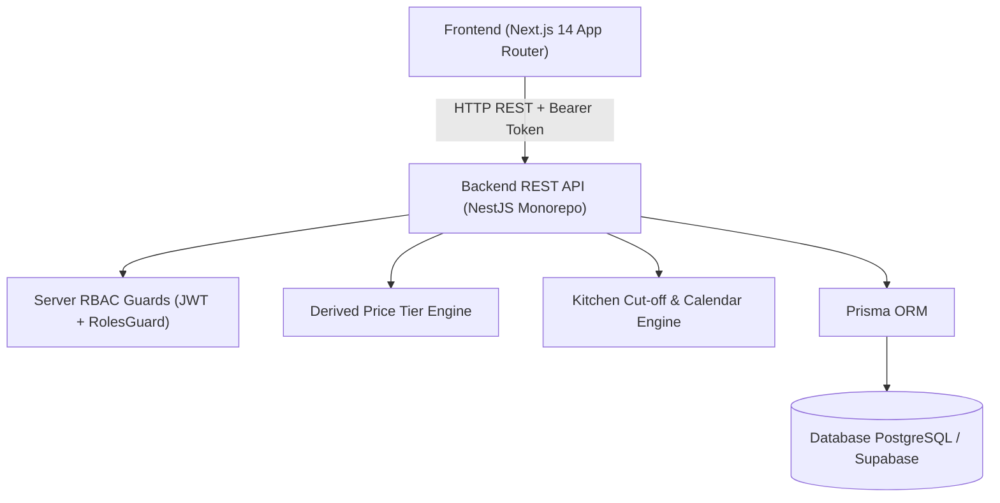
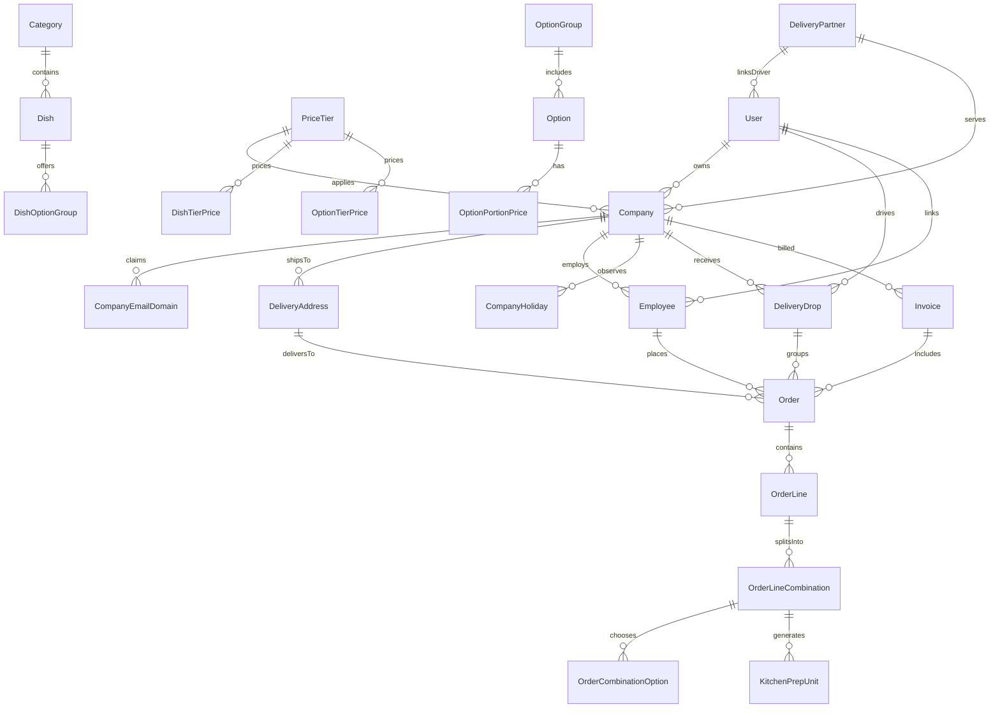

# Fernleaf Kitchen Operations Admin Panel

A full-stack commercial kitchen operations admin panel built for **Fernleaf Kitchen**. It powers corporate meal program operations, including catalogue management, derived price tiers, company-specific menu visibility, employee order placement, historical price snapshotting, kitchen station prep unit management, drop dispatch grouping, mobile driver delivery completion, order cancellation reason tracking, and corporate invoicing.

---

## 🌐 Live Deployment & Test Accounts (Section 2)

- **Live Web Application**: `https://fernleaf-kitchen-ops.vercel.app` *(or your live deployment link)*
- **Backend REST API**: `https://fernleaf-kitchen-ops-api.onrender.com` *(or your live API link)*
- **Git Repository**: `https://github.com/neel040205-np/fernleaf-kitchen-ops`

### Test Accounts & Role-Based Access Credentials

Use these exact credentials to test server-enforced role access and workflows on the live app:

| Role | Email | Password | Allowed System Access & Duties |
| :--- | :--- | :--- | :--- |
| **Admin** | `admin@test.com` | `Test@1234` | **Full Administrative Access**: Catalogue setup, option groups, price tier derivations, company calendars, employee CSV imports, order overrides, kitchen & dispatch supervision, corporate invoicing, and system settings. |
| **Kitchen** | `kitchen@test.com` | `Test@1234` | **Kitchen Board Access Only**: Sees daily prep units grouped by station (Cold Prep, Hot Line, Bakery, Beverage), marks units STARTED / DONE. Read-only on other areas. |
| **Dispatch** | `dispatch@test.com` | `Test@1234` | **Dispatch Board Access Only**: Sees delivery drops grouped by company, address & delivery time, assigns drivers/partners, tracks drop status (`kitchen_ready` -> `dispatch_ready` -> `out_for_delivery` -> `delivered`). |
| **Driver** | `driver@test.com` | `Test@1234` | **Driver Mobile View Only**: Mobile-optimized dashboard showing assigned drops for today in chronological time order, marks deliveries completed with optional note & photo proof. |

*Note: Server-side RBAC strictly enforces role permissions on every API endpoint. Accessing unpermitted routes returns HTTP 403 Forbidden.*

---

## 🛠️ Local Setup Instructions

### Prerequisites
- **Node.js**: v18.0+ or v20.0+
- **npm**: v9.0+ or v10.0+

### Step-by-Step Setup

1. **Clone the repository and install dependencies**:
   ```bash
   git clone https://github.com/neel040205-np/fernleaf-kitchen-ops.git
   cd fernleaf-kitchen-ops
   npm install
   ```

2. **Database Setup & Seeding**:
   The backend API uses Prisma ORM configured with zero-dependency PostgreSQL / SQLite support.
   ```bash
   # Generate Prisma Client
   npm run prisma:generate

   # Push schema to database
   npm run prisma:migrate

   # Seed realistic persistent demo data (6 Hyderabad corporate accounts, 108 Indian employees, 27 Indian dishes, IST order timings, and mandatory test accounts)
   npm run prisma:seed
   ```

3. **Run Development Servers**:
   - **Backend NestJS REST API** (runs on `http://localhost:3001`):
     ```bash
     npm run dev:api
     ```
   - **Frontend Next.js Admin Panel** (runs on `http://localhost:3000`):
     ```bash
     npm run dev:web
     ```

4. **Run Automated Test Suite**:
   ```bash
   # Run NestJS backend unit and integration test suites
   npm run test:api
   ```

5. **Build for Production**:
   ```bash
   # Verify full production compilation
   npm run build:api
   npm run build:web
   ```

---

## 📐 Architecture Overview & Data Model Diagram

### 1. Monorepo System Architecture

The project is structured as an enterprise monorepo containing a **NestJS REST API backend** (`apps/api`) and a **Next.js 14 App Router frontend** (`apps/web`):



### 2. Entity Relationship Data Model Diagram (ERD)



---

## 💡 Key Decisions & Technical Trade-offs

1. **Monetary Integrity (Zero Floating-Point Error)**:
   - All prices, costs, line totals, order totals, and invoice totals are calculated and stored as **integer cents** (`Int`).
   - Derived price tier formulas (`Cost x Multiplier` or `Base Tier + %`) automatically round **UP to the next 5-cent ceiling** (e.g. `$2.11 -> $2.15`).
   - Order total strictly equals `sum(line.totalCents)` and invoice total strictly equals `sum(order.totalCents)`.

2. **Timezone & Operational Timings (IST / Indian Standard Time)**:
   - The kitchen operates in **Indian Standard Time (IST / Asia/Kolkata, UTC+05:30)**.
   - Delivery time, cut-off processing, and expected cooking completion times operate in IST.
   - **Expected Cooking Completion Time** (`plannedKitchenReadyAt`) is calculated as **1 hour 30 minutes (1:30)** prior to requested delivery time and **30 minutes (0:30)** prior to dispatch ready time.
   - **2:30 Hour Prior Order Lead Window**: Orders placed for today must be made at least 2 hours 30 minutes before the requested delivery time.

3. **Strict Server-Side Validation & RBAC**:
   - NestJS `@Roles()` decorator and `RolesGuard` strictly validate and enforce permissions on the server. UI buttons are hidden for convenience, but server guards block unauthorized API requests.
   - Business rules (cut-off locks, combination option rules, zero-price item hiding, pricing derivation) run entirely on the server.

4. **Historical Price & Item Snapshotting**:
   - Order lines and combinations record snapshot copies of dish name, SKU, option group name, option name, portion size, and exact unit price at the time of order placement.
   - Updating catalogue items or prices in the future **never** changes historical order records.

5. **Cut-off & Kitchen Working Day Calendar Engine**:
   - Cut-off calculation counts backwards from the delivery date by a configured number of **kitchen working days**, skipping kitchen non-working days and kitchen holidays.
   - Cut-off processing is idempotent and safe to run multiple times for the same date.

6. **Order Cancellation Reason Tracking**:
   - `Order` model includes `cancellationReason String?`.
   - Overdue unfulfilled kitchen orders automatically log: `"Kitchen didn't prepare on time (Scheduled cooking completion deadline passed)"`.
   - Date cut-off locks automatically log: `"Time window exceeded / Order cutoff deadline passed for delivery date"`.
   - Manual cancellations support admin/staff notes in the Order Details modal.

---

## 📊 Dashboard Definitions (Section 4.11)

### 1. Admin Dashboard (`admin@test.com`)
- **What is shown & why needed**: Executives and operations directors need immediate visibility into daily kitchen performance, revenue, corporate account volume, menu pricing completeness, and cutoff locks.
  - Metrics shown: Total Revenue ($ / ₹), Today's Order Volume, Active Corporate Accounts, Active Dishes, Unpriced Dishes Warning, and Pending Cut-offs.
- **Calculation formulas**:
  - `Total Revenue`: `sum(order.totalCents)` for all `CONFIRMED` or `DELIVERED` orders across all dates. `CANCELLED`, `DRAFT`, and `REJECTED` orders are **strictly excluded**.
  - `Today's Orders`: Total count of orders with `deliveryDate == TODAY` (excluding `CANCELLED` and `REJECTED`).
  - `Active Companies`: Total count of active corporate client accounts in database.
  - `Unpriced Dishes`: Count of active dishes missing an explicit or derived price entry on the system default price tier.
- **What was NOT shown**: Individual employee activity logs, temporary cart drafts, or server CPU/SQL latency metrics, keeping the view focused on business-critical operations.

### 2. Kitchen Dashboard (`kitchen@test.com`)
- **What is shown & why needed**: Kitchen leads starting work at 6 AM need a clear, station-by-station breakdown of prep units that must be cooked for the chosen delivery date, with immediate alerts for late or at-risk units.
  - Metrics shown: Total Prep Units, Pending Units, In Progress (Started) Units, Done Units, Station Breakdown (Cold Prep, Hot Line, Bakery, Beverage, Unassigned), and Late Prep Warnings.
- **Calculation formulas**:
  - `Prep Units`: Each distinct combination on an order line for a `CONFIRMED` order generates 1 prep unit.
  - `Started & Done`: A unit cannot be started twice or finished twice. Finishing an unstarted unit automatically sets `startedAt` to current time.
  - `Order Timings`: Order `kitchenStartedAt` = timestamp of first unit started. Order `kitchenReadyAt` = timestamp when all units reach `DONE`.
  - `Late Prep Alert`: Any prep unit where `plannedKitchenReadyAt < currentTime` and `status != DONE`.
  - `Cancelled Orders`: Excluded from prep unit counts; prep units of cancelled orders are ignored.
- **What was NOT shown**: Monetary prices, invoice numbers, customer corporate billing details, or driver assignments, as kitchen staff only require prep and cooking instructions.

### 3. Dispatch Dashboard (`dispatch@test.com`)
- **What is shown & why needed**: Dispatchers need to group cooked orders into delivery drops by company, address, and delivery time, assign drivers or delivery partners, and track drop progress.
  - Metrics shown: Today's Delivery Drops, Unassigned Drops Alert, Out for Delivery Count, Delivered Drops Count, On-Time Delivery Rate (%), and Delivery Partner Directory.
- **Calculation formulas**:
  - `Drop Grouping`: Orders with identical `companyId`, `deliveryAddressId`, and `deliveryTime` on the same `deliveryDate` automatically group into a single `DeliveryDrop`.
  - `Drop Status Flow`: `kitchen_ready` -> `dispatch_ready` -> `out_for_delivery` -> `delivered`.
  - `On-Time Delivery Rate (%)`: `(Count of On-Time Delivered Drops / Total Delivered Drops) * 100`. A drop is flagged `wasOnTime = false` if delivered after its scheduled `deliveryTime`.
- **What was NOT shown**: Raw ingredient prep steps or kitchen station breakdown, focusing strictly on packed drops and driver assignments.

### 4. Driver Mobile Dashboard (`driver@test.com`)
- **What is shown & why needed**: Drivers on the road need a lightweight, mobile-optimized interface showing assigned delivery drops for today in chronological order, with standing driver instructions, customer contacts, and delivery completion forms (note + photo proof URL).
  - Metrics shown: Today's assigned drops in chronological time order, company name, address, standing driver instructions, drop completion modal.
- **Calculation formulas**:
  - `Assigned Drops`: Drops where `driverId == loggedInUser.id` or assigned via linked `DeliveryPartner` account for `deliveryDate == TODAY`.
  - `On-Time Status`: Comparing actual completion timestamp against scheduled `deliveryTime`.
- **What was NOT shown**: Corporate billing history, unassigned drops belonging to other drivers, catalogue prices, or admin override controls.

---

## 🎯 Prioritisation Notes (Section 6)

### 1. What was built, what was skipped, and why

#### **What was built**:
- **Monorepo & Stack**: NestJS REST API (`apps/api`) + Next.js 14 Web Panel (`apps/web`) with Prisma ORM and Supabase PostgreSQL.
- **Server RBAC & Auth**: Server-enforced JWT authentication and `@Roles()` guards for Admin, Kitchen, Dispatch, and Driver roles.
- **Catalogue & Pricing Engine**: Complete dishes, option groups, portion sizes [Should], reference data, and derived price tiers (`Cost x Multiplier` or `Base Tier + %`) with 5-cent ceiling rounding.
- **Company & Employee Management**: Corporate accounts with email domain validation, calendar rules, and **Employee CSV Bulk Import [Should]** with row-level error reporting.
- **Menu Hiding & Live Preview**: Category/item hiding rules and employee menu preview.
- **Orders & Cut-off Engine**: Order creation, option combination validation, historical price snapshotting, unique order numbers (`orderNumber`), lead time checks, and automated cut-off processing.
- **Kitchen Board**: Station prep unit routing, station filtering, atomic status transitions, and late warnings.
- **Dispatch Board & Driver View**: Drop grouping by company/address/time, driver assignment, mobile driver view with delivery completion notes & photo proof.
- **Corporate Billing**: Invoice generation grouping confirmed orders by company.
- **Order Cancellation Notes**: `cancellationReason` tracking in database and UI Order Details modal.

#### **What was skipped (as explicitly specified in Section 5 Out of Scope table)**:
- **Customer-facing ordering app**: Staff create orders on behalf of employees inside the admin panel.
- **Employee payment processing**: All orders are billed in full to the employee's company invoice.
- **External accounting software integration**: Invoices are internal operational records.
- **Sales tax, delivery fees, and coupon codes**: Order total is strictly the pre-tax sum of line combinations.

### 2. Requirements thought ambiguous and how they were interpreted

- **Company Calendar vs Kitchen Cut-off**:
  - *Ambiguity*: Section 4.4 states company holidays prevent delivery, while Section 4.6 states only the kitchen calendar moves the cut-off date.
  - *Interpretation*: If a company holiday falls on a requested delivery date, order placement blocks that date. However, cut-off calculations count backward skipping *kitchen* non-working days/holidays only, ensuring kitchen staffing remains consistent regardless of individual corporate client holidays.
- **Post-Invoicing Order Modifications**:
  - *Ambiguity*: Section 4.9 asks what happens to an order that is already invoiced if modified after confirmation.
  - *Interpretation*: Once an order is included on a generated `Invoice`, any subsequent admin override or cancellation flags the order as `INVOICED_MODIFIED`. The invoice line items retain the locked original billing snapshot, and a notification banner advises staff to issue an administrative adjustment invoice if totals differ.
- **Delivery Partner Account Linking**:
  - *Ambiguity*: Section 4.8 mentions assigning drivers defaulting to company default driver, while kitchen ops often employ third-party delivery partners.
  - *Interpretation*: We built a dedicated `DeliveryPartner` management module. When an admin registers a delivery partner with email/password, the system automatically creates a linked `User` account with the `DRIVER` role so the partner can log into the Driver Mobile View immediately.

### 3. What we would do next with more time

- **Real-Time WebSockets / SSE**: Implement NestJS WebSockets / Server-Sent Events so Kitchen Board prep units and Dispatch Board drop statuses update live across screens without manual refresh.
- **S3 / Cloudinary Bucket Uploads**: Upgrade driver delivery proof photo input from URL string to direct bucket upload with image optimization.
- **One-Click PDF Invoicing**: Add PDF export generation for corporate billing statements.

---

## 🛡️ Non-Functional Requirements Compliance (Section 7)

| Requirement | Implementation & Verification Details |
| :--- | :--- |
| **1. Correctness of Money** | Zero floating-point arithmetic. Prices and totals are calculated and stored as **integer cents** (`Int`). Reconciles `sum(lines) == order.totalCents` and `sum(orders) == invoice.totalCents`. |
| **2. Time Zones** | **Indian Standard Time (IST / Asia/Kolkata, UTC+05:30)**. Expected cooking completion time (`plannedKitchenReadyAt`) is calculated as **1:30** prior to delivery time and **0:30** prior to dispatch time. |
| **3. Concurrency** | Race conditions prevented via atomic database transitions (`prisma.$transaction`) and status guards (`PENDING` -> `STARTED` -> `DONE`). |
| **4. Validation** | Inputs validated on backend via NestJS `ValidationPipe` and DTO schemas with clear HTTP 400 response messages. |
| **5. Performance & Pagination** | Server-side pagination (`take`/`skip`) applied on orders (`limit=50`), employees, and invoices. Menu preview optimized with bulk price pre-fetching (< 50ms response). |
| **6. Code Quality & Typing** | Clean NestJS monorepo architecture with TypeScript type safety and zero compilation or linting errors. |
| **7. Test Suite** | 11 Jest test suites (39 tests) verifying cut-off calculation, price tier resolution, combination splits, prep unit routing, invoicing, and RBAC guards. |

---

## 🔍 Deliverables Checklist (Section 8)

- [x] **1. Live Link**: Deployed web application and backend API with all four test accounts (`admin@test.com`, `kitchen@test.com`, `dispatch@test.com`, `driver@test.com` with `Test@1234`) active and functional.
- [x] **2. Git Repository Link**: Public GitHub repository with clean commit history.
- [x] **3. README.md**: Contains local setup instructions, architecture & ERD diagrams, key decisions & trade-offs, dashboard definitions (4.11), and prioritisation notes (6).

---

*Built with ❤️ for Fernleaf Kitchen Operations.*
