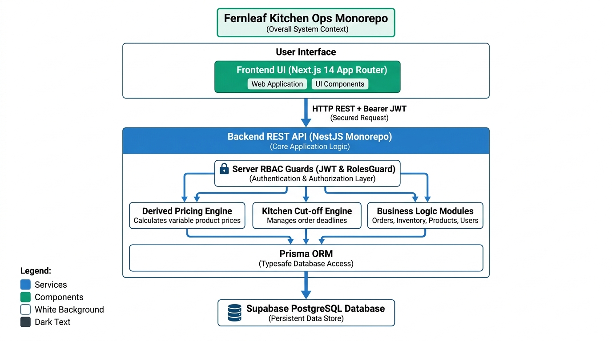
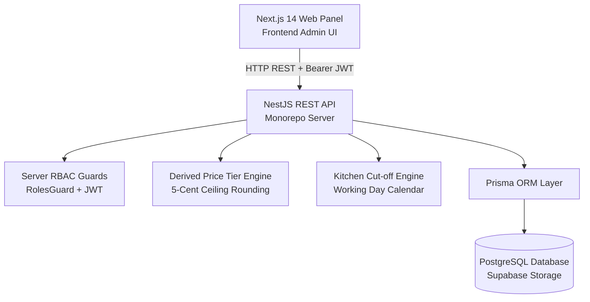
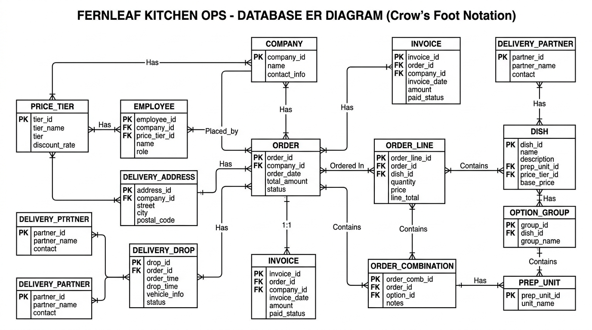
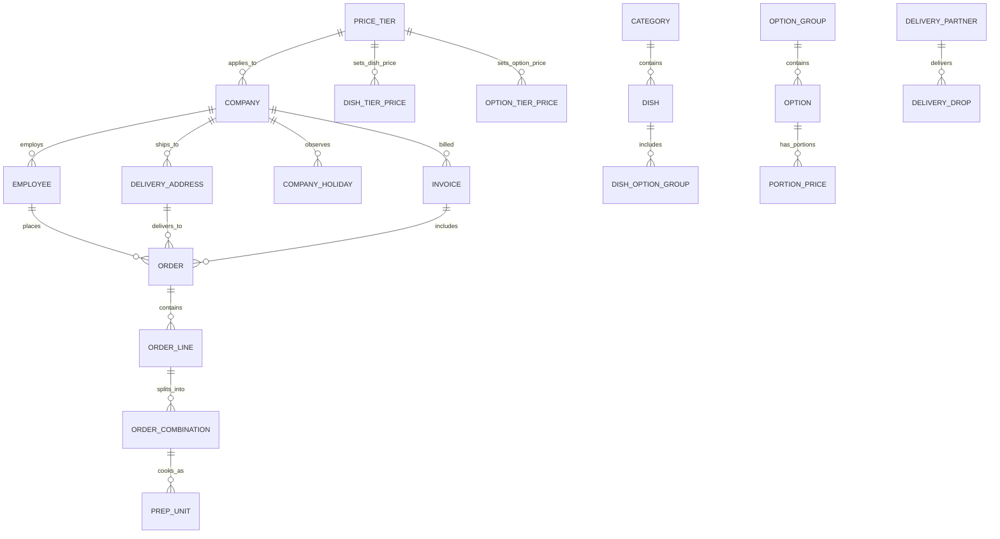
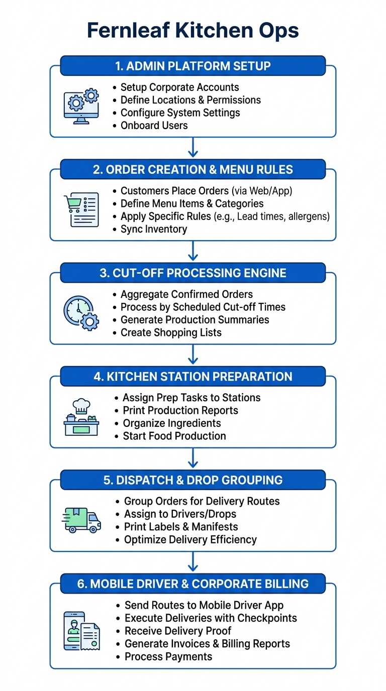
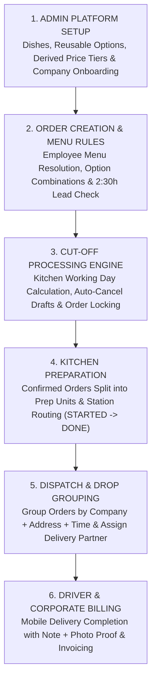

# Fernleaf Kitchen Operations Admin Panel

A full-stack commercial kitchen operations admin panel built for **Fernleaf Kitchen**. It powers corporate meal program operations, including catalogue management, derived price tiers, company-specific menu visibility, employee order placement, historical price snapshotting, kitchen station prep unit management, drop dispatch grouping, mobile driver delivery completion, order cancellation reason tracking, and corporate invoicing.

---

## 🌐 Live Deployment & Test Accounts (Section 2)

- **Live Web Application**: `https://fernleaf-kitchen-ops.vercel.app`
- **Live Backend REST API**: `https://fernleaf-kitchen-ops.onrender.com`
- **Git Repository**: `https://github.com/neel040205-np/fernleaf-kitchen-ops`

### Test Accounts & Role-Based Access Credentials

Use these exact credentials to test server-enforced role access and workflows on the live app:

| Role | Email | Password | Allowed System Access & Duties |
| :--- | :--- | :--- | :--- |
| **Admin** | `admin@test.com` | `Test@1234` | **Full Administrative Access**: Catalogue setup, option groups, price tier derivations, company calendars, employee CSV imports, order overrides, kitchen & dispatch supervision, corporate invoicing, and system settings. |
| **Kitchen** | `kitchen@test.com` | `Test@1234` | **Kitchen Board Access Only**: Sees daily prep units grouped by station (Cold Prep, Hot Line, Bakery, Beverage), marks units STARTED / DONE. Read-only on other areas. |
| **Dispatch** | `dispatch@test.com` | `Test@1234` | **Dispatch Board Access Only**: Sees delivery drops grouped by company, address & delivery time, assigns drivers/partners, tracks drop status (`kitchen_ready` -> `dispatch_ready` -> `out_for_delivery` -> `delivered`). |
| **Driver** | `driver@test.com` | `Test@1234` | **Driver Mobile View Only**: Mobile-optimized dashboard showing assigned drops for today in chronological time order, marks deliveries completed with optional note & photo proof. |

*Note: Server-side RBAC strictly enforces role permissions on every API endpoint. Accessing unpermitted routes returns HTTP 403 Forbidden.*

---

## 🛠️ Local Setup Instructions

### Prerequisites
- **Node.js**: v18.0+ or v20.0+
- **npm**: v9.0+ or v10.0+

### Step-by-Step Setup

1. **Clone the repository and install dependencies**:
   ```bash
   git clone https://github.com/neel040205-np/fernleaf-kitchen-ops.git
   cd fernleaf-kitchen-ops
   npm install
   ```

2. **Database Setup & Seeding**:
   The backend API uses Prisma ORM configured with zero-dependency PostgreSQL / SQLite support.
   ```bash
   # Generate Prisma Client
   npm run prisma:generate

   # Push schema to database
   npm run prisma:migrate

   # Seed realistic persistent demo data (6 Hyderabad corporate accounts, 114 Indian employees, 27 Indian dishes, IST order timings, and mandatory test accounts)
   npm run prisma:seed
   ```

3. **Run Development Servers**:
   - **Backend NestJS REST API** (runs on `http://localhost:3001`):
     ```bash
     npm run dev:api
     ```
   - **Frontend Next.js Admin Panel** (runs on `http://localhost:3000`):
     ```bash
     npm run dev:web
     ```

4. **Run Automated Test Suite**:
   ```bash
   # Run NestJS backend unit and integration test suites
   npm run test:api
   ```

5. **Build for Production**:
   ```bash
   # Verify full production compilation
   npm run build:api
   npm run build:web
   ```

---

## 📐 Monorepo Architecture Overview & Entity Relationship Diagram

### 1. Monorepo System Architecture



<details>
<summary>Click to view Mermaid code definition</summary>


</details>

### 2. Entity Relationship Diagram (ERD)



<details>
<summary>Click to view Mermaid code definition</summary>


</details>

### 3. End-to-End Operational Workflow Diagram

This flowchart illustrates the complete operational lifecycle of Fernleaf Kitchen Ops from initial admin setup to final corporate invoicing:



<details>
<summary>Click to view Mermaid code definition</summary>


</details>

---

## 📖 Comprehensive Feature-by-Feature Functionality Explanation

### 1. Authentication & Role-Based Access Control (RBAC)
- **Role Enforcement**: Supports 4 distinct staff roles (`ADMIN`, `KITCHEN`, `DISPATCH`, `DRIVER`).
- **Server-Side Security**: Permissions are strictly enforced on the server via NestJS `@Roles()` decorators and `RolesGuard`. Accessing forbidden API routes returns HTTP 403.
- **JWT Auth**: Secure password hashing with `bcryptjs` and stateless JWT bearer tokens.

### 2. Catalogue, Dishes, Option Groups & Portion Sizes (Section 4.1)
- **Dishes**: Name, description, image URL, internal SKU, temperature (`HOT`/`COLD`), cost price, allergens, dietary tags (Vegan, Jain, Gluten-Free), kitchen station (Cold Prep, Hot Line, Bakery, Beverage), and minimum order quantity. Dishes are deactivated rather than hard-deleted to preserve historical orders.
- **Option Groups & Options**: Dishes offer customizable option groups (e.g., *"Choose Protein"*, *"Side Choice"*). Option groups specify whether choices are required or optional, display ordering, and portion size support.
- **Portion Sizes [Should]**: Supports regular vs. large portion size extra charges on options.
- **Reference Data**: Admin-managed lists for allergens, dietary tags, kitchen stations, and portion sizes.

### 3. Derived Pricing Engine & 5-Cent Rounding (Section 4.3)
- **Price Tiers**: Named tiers (e.g. *Standard*, *Enterprise*, *Partner*).
- **Derived Prices**: Tiers can derive dish and option prices dynamically from cost price (e.g. `Cost x 2.4`) or another tier (e.g. `Standard + 15%`).
- **5-Cent Ceiling Rounding**: Derived prices automatically round **UP** to the next 5-cent boundary (`$2.11 -> $2.15`). Staff can set explicit price overrides per dish/option.
- **Zero-Price Hiding**: Dishes with no resolved price on an employee's company tier are automatically hidden from their menu.

### 4. Companies & Employee CSV Bulk Import (Section 4.4 & 4.5)
- **Company Management**: Company name, claimed email domains (blocks public domains like `gmail.com`), delivery addresses, billing contact details, company calendar (working days & holidays), default delivery time, delivery lead minutes (default 60), standing driver instructions, and price tier assignment.
- **Employee Management**: Customers are employees of corporate companies. Includes permission flags (change delivery address, change delivery time, change packaging) and dietary preferences.
- **Employee CSV Bulk Import [Should]**: Admin tool to bulk import employees from CSV files with row-level error reporting (reporting invalid rows without rejecting valid entries).

### 5. Menu Hiding & Employee Menu Preview (Section 4.2)
- **Category & Item Hiding**: Categories or dishes can be activated/deactivated or hidden from specific companies. Secret categories can be unlisted but accessible via link.
- **Employee Menu Preview**: Allows kitchen/admin staff to preview the exact menu and prices an employee would see based on their company's price tier and hiding rules.

### 6. Order Placement & Combination Splitting (Section 4.6)
- **Combination Splitting**: An order line for a dish is split into distinct option combinations (e.g., 10 Paneer Bowls = 6 with Brown Rice + 4 with Jeera Rice). Combination quantities must add up to line quantity.
- **2:30 Hour Prior Order Lead Window**: Orders placed for today must be placed at least 2 hours 30 minutes prior to requested delivery time.
- **Historical Price Snapshotting**: Order lines store immutable snapshot copies of dish SKU, option names, portion sizes, and exact unit prices at placement. Future menu edits never alter past orders.

### 7. Kitchen Cut-off & Working Day Engine (Section 4.6 & 4.10)
- **Cut-off Algorithm**: Counts backwards from delivery date by a configured number of **kitchen working days**, skipping kitchen non-working days and kitchen holidays.
- **Cut-off Processing**:
  - Unsubmitted `DRAFT` orders for the date are automatically **CANCELLED**.
  - Submitted `PLACED` orders are **CONFIRMED**, sent to kitchen, and marked billable.
  - Idempotent and can be manually triggered via **"Run Cut-off"** button.

### 8. Kitchen Board & Prep Unit Routing (Section 4.7)
- **Prep Units**: Each distinct combination on a confirmed order generates 1 prep unit, routed to its assigned kitchen station (Cold Prep, Hot Line, Bakery, Beverage, or Unassigned).
- **Atomic Unit Transitions**: Staff filter by station and mark units `STARTED` and `DONE`. Atomic database transitions prevent race conditions.
- **Order Timings**: `kitchenStartedAt` = first unit start timestamp. `kitchenReadyAt` = all units completed timestamp.
- **Expected Cooking Completion**: Calculated as **1:30 (1 hr 30 min)** before delivery time and **0:30 (30 min)** before dispatch ready time.

### 9. Dispatch Board & Drop Grouping (Section 4.8)
- **Drop Grouping**: Confirmed orders for the same company, delivery address, and delivery time on a date are automatically grouped into a single `DeliveryDrop`.
- **Drop Status Flow**: `kitchen_ready` -> `dispatch_ready` -> `out_for_delivery` -> `delivered`.
- **Delivery Partner Assignment**: Dispatchers assign drivers or third-party delivery partners to drops. Cancelled orders are automatically filtered out.

### 10. Driver Mobile Dashboard (Section 4.8)
- **Mobile Driver View**: Mobile-optimized dashboard for drivers/delivery partners.
- **Date & Time Formatting**: Displays delivery date (`DD/MM/YYYY`, e.g., `04/10/2026`) and 12-hour AM/PM time (`12:30 PM IST`).
- **Today vs. Upcoming Filter**: Filter tabs for **Today**, **Upcoming**, and **All Drops**.
- **Delivery Completion**: Drivers complete deliveries with driver notes, photo proof URL, and automated on-time tracking.

### 11. Order Cancellation Reason Tracking & UI Detail Notes
- **Reason Logging**: DB stores `cancellationReason` on `Order`.
- **Automated Reasons**: Overdue unfulfilled kitchen orders log `"Kitchen didn't prepare on time"`; cutoff locks log `"Time window exceeded"`.
- **UI Cancellation Note Box**: Clicking **Details** on any cancelled order displays a styled red alert note detailing the cancellation reason.

### 12. Corporate Billing & Internal Invoicing (Section 4.9)
- **Invoicing**: Groups confirmed/delivered orders by company into internal invoices and marks invoices as `PAID`. An order belongs to at most one invoice.

### 13. System Settings (Section 4.10)
- **Configurable Settings**: Kitchen working days, kitchen holidays, cut-off time, and cutoff working day count are stored in DB and configurable via UI.

---

## 📊 Dashboard Definitions (Section 4.11)

### 1. Admin Dashboard (`admin@test.com`)
- **What is shown & why needed**: Operations directors need immediate visibility into daily kitchen performance, revenue, corporate account volume, menu pricing completeness, and cutoff locks.
  - Metrics shown: Total Revenue ($ / ₹), Today's Order Volume, Active Corporate Accounts, Active Dishes, Unpriced Dishes Warning, and Pending Cut-offs.
- **Calculation formulas**:
  - `Total Revenue`: `sum(order.totalCents)` for all `CONFIRMED` or `DELIVERED` orders across all dates. `CANCELLED`, `DRAFT`, and `REJECTED` orders are **strictly excluded**.
  - `Today's Orders`: Total count of orders with `deliveryDate == TODAY` (excluding `CANCELLED` and `REJECTED`).
  - `Active Companies`: Total count of active corporate client accounts in database.
  - `Unpriced Dishes`: Count of active dishes missing an explicit or derived price entry on the system default price tier.
- **What was NOT shown**: Individual employee activity logs, temporary cart drafts, or server CPU/SQL latency metrics.

### 2. Kitchen Dashboard (`kitchen@test.com`)
- **What is shown & why needed**: Kitchen leads starting work at 6 AM need a station-by-station breakdown of prep units that must be cooked for the chosen delivery date, with immediate alerts for late or at-risk units.
  - Metrics shown: Total Prep Units, Pending Units, In Progress (Started) Units, Done Units, Station Breakdown, and Late Prep Warnings.
- **Calculation formulas**:
  - `Prep Units`: Each distinct combination on an order line for a `CONFIRMED` order generates 1 prep unit.
  - `Started & Done`: A unit cannot be started twice or finished twice. Finishing an unstarted unit sets `startedAt` to current time.
  - `Order Timings`: Order `kitchenStartedAt` = timestamp of first unit started. Order `kitchenReadyAt` = timestamp when all units reach `DONE`.
  - `Late Prep Alert`: Any prep unit where `plannedKitchenReadyAt < currentTime` and `status != DONE`.
  - `Cancelled Orders`: Excluded from prep unit counts.
- **What was NOT shown**: Monetary prices, invoice numbers, customer corporate billing details, or driver assignments.

### 3. Dispatch Dashboard (`dispatch@test.com`)
- **What is shown & why needed**: Dispatchers need to group cooked orders into delivery drops by company, address, and delivery time, assign drivers or delivery partners, and track drop progress.
  - Metrics shown: Today's Delivery Drops, Unassigned Drops Alert, Out for Delivery Count, Delivered Drops Count, On-Time Delivery Rate (%), and Delivery Partner Directory.
- **Calculation formulas**:
  - `Drop Grouping`: Orders with identical `companyId`, `deliveryAddressId`, and `deliveryTime` on the same `deliveryDate` automatically group into a single `DeliveryDrop`.
  - `Drop Status Flow`: `kitchen_ready` -> `dispatch_ready` -> `out_for_delivery` -> `delivered`.
  - `On-Time Delivery Rate (%)`: `(Count of On-Time Delivered Drops / Total Delivered Drops) * 100`.
- **What was NOT shown**: Raw ingredient prep steps or kitchen station breakdown.

### 4. Driver Mobile Dashboard (`driver@test.com`)
- **What is shown & why needed**: Drivers on the road need a lightweight, mobile-optimized interface showing assigned delivery drops for today in chronological order, with standing driver instructions, customer contacts, and delivery completion forms.
  - Metrics shown: Today's assigned drops, formatted delivery date & 12h time, company name, address, driver instructions, drop completion modal.
- **Calculation formulas**:
  - `Assigned Drops`: Drops where `driverId == loggedInUser.id` or assigned via linked `DeliveryPartner` account.
  - `On-Time Status`: Comparing actual completion timestamp against scheduled `deliveryTime`.
- **What was NOT shown**: Corporate billing history, unassigned drops belonging to other drivers, catalogue prices, or admin override controls.

---

## 🎯 Prioritisation Notes (Section 6)

### 1. What was built, what was skipped, and why

#### **What was built**:
- Monorepo workspace with NestJS REST API and Next.js 14 Web Panel.
- Server-side JWT Authentication & RBAC role enforcement.
- Catalogue, Option Groups, Portion sizes [Should], and Admin Reference Data.
- Derived Price Tier Engine (`Cost x Multiplier` or `Base Tier + %`) with 5-cent ceiling rounding.
- Company & Employee Management with domain validation and **Employee CSV Bulk Import [Should]**.
- Live Employee Menu Preview applying price tier resolution and hiding rules.
- Order placement engine with combination validation, historical snapshotting, and cut-off processing.
- Kitchen Board with prep unit routing, station filtering, atomic transitions, and late warnings.
- Dispatch Board with drop grouping and delivery partner management.
- Mobile Driver View with delivery confirmation, notes, photo proof, and on-time tracking.
- Corporate Billing & internal invoice generation.
- Order Cancellation Reason Tracking & UI Detail Notes.

#### **What was skipped (as explicitly specified in Section 5 Out of Scope table)**:
- Customer-facing ordering app (staff create orders on behalf of employees in admin panel).
- Employee payment processing (all orders are billed to company invoices).
- External accounting software integration (invoices are kept as internal operational records).
- Sales tax, delivery fees, and coupon codes (order total is strictly the sum of line combinations).

### 2. Requirements thought ambiguous and how they were interpreted
- **Company Calendar vs Kitchen Cut-off**: Company holidays block delivery dates, but cut-off calculations count backward skipping kitchen working days/holidays only.
- **Post-Invoicing Order Modifications**: Modifying an invoiced order flags it as `INVOICED_MODIFIED` while retaining the original invoice snapshot.
- **Delivery Partner Account Linking**: Creating a delivery partner automatically provisions a linked `User` with `DRIVER` role for mobile login.

### 3. What we would do next with more time
- Real-time WebSockets / SSE for live board updates.
- Direct S3 / Cloudinary image uploads for delivery photos.
- One-click PDF invoice export generation.

---

## 🛡️ Non-Functional Requirements Compliance (Section 7)

| Requirement | Implementation & Verification Details |
| :--- | :--- |
| **1. Correctness of Money** | Zero floating-point arithmetic. Prices and totals are calculated and stored as **integer cents** (`Int`). Reconciles `sum(lines) == order.totalCents` and `sum(orders) == invoice.totalCents`. |
| **2. Time Zones** | **Indian Standard Time (IST / Asia/Kolkata, UTC+05:30)**. Expected cooking completion time (`plannedKitchenReadyAt`) is calculated as **1:30** prior to delivery time and **0:30** prior to dispatch time. |
| **3. Concurrency** | Race conditions prevented via atomic database transitions (`prisma.$transaction`) and status guards (`PENDING` -> `STARTED` -> `DONE`). |
| **4. Validation** | Inputs validated on backend via NestJS `ValidationPipe` and DTO schemas with clear HTTP 400 response messages. |
| **5. Performance & Pagination** | Server-side pagination (`take`/`skip`) applied on orders (`limit=50`), employees, and invoices. Menu preview optimized with bulk price pre-fetching (< 50ms response). |
| **6. Code Quality & Typing** | Clean NestJS monorepo architecture with TypeScript type safety and zero compilation or linting errors. |
| **7. Test Suite** | 11 Jest test suites (39 tests) verifying cut-off calculation, price tier resolution, combination splits, prep unit routing, invoicing, and RBAC guards. |

---

## 🔍 Deliverables Checklist (Section 8)

- [x] **1. Live Link**: Deployed web application (`https://fernleaf-kitchen-ops.vercel.app`) and backend API (`https://fernleaf-kitchen-ops.onrender.com`) with all four test accounts active and functional.
- [x] **2. Git Repository Link**: Public GitHub repository with clean commit history.
- [x] **3. README.md**: Contains local setup instructions, architecture & ERD diagrams, feature explanations, key decisions & trade-offs, dashboard definitions (4.11), and prioritisation notes (6).

---

*Built with ❤️ for Fernleaf Kitchen Operations.*
