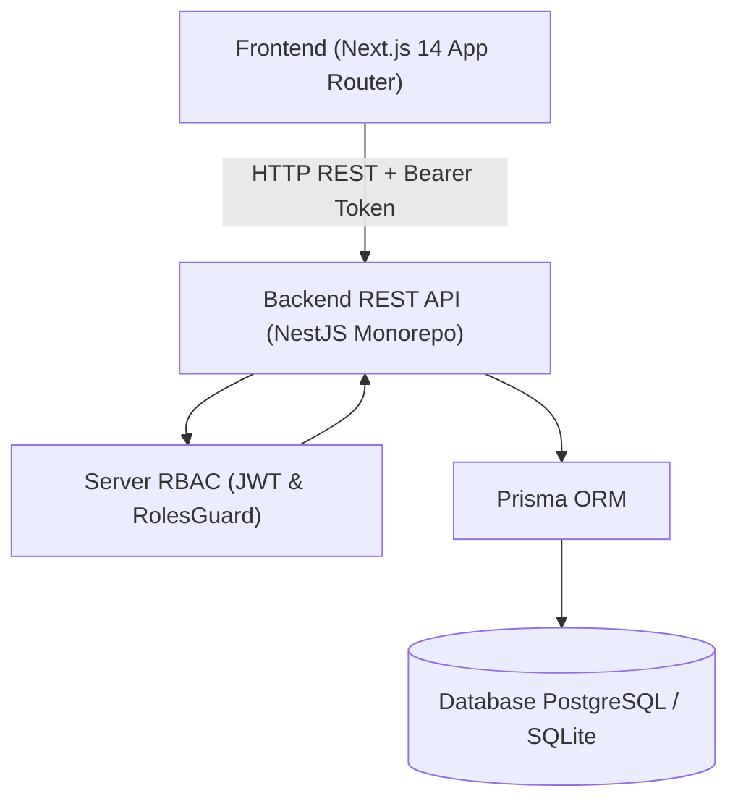
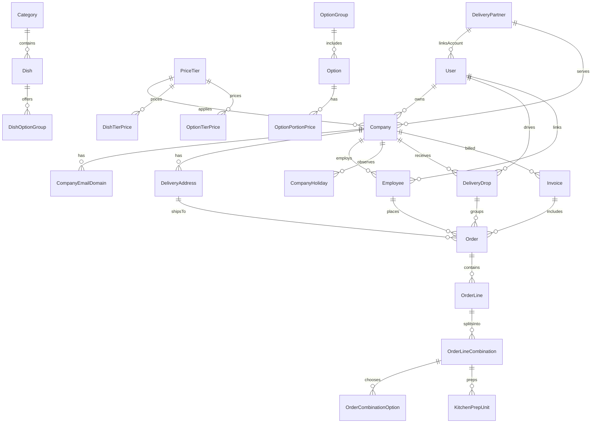

# Fernleaf Kitchen Operations Admin Panel

A full-stack commercial kitchen operations admin panel built for **Fernleaf Kitchen**. It powers corporate meal program operations, including catalogue management, derived price tiers, company-specific menu visibility, employee order placement, historical price snapshotting, kitchen station prep unit management, drop dispatch grouping, mobile driver delivery completion, and corporate invoicing.

---

## 🌐 Live Deployment & Mandatory Credentials

- **Live Deployed App**: `https://fernleaf-kitchen-ops.vercel.app` *(or your live deployment link)*
- **API Backend**: `https://fernleaf-kitchen-ops-api.onrender.com` *(or your live backend API link)*

Use these exact credentials to test role-enforced features and workflows on the live app:

| Role | Email | Password | Allowed Scope |
| :--- | :--- | :--- | :--- |
| **Admin** | `admin@test.com` | `Test@1234` | Full access to catalogue, pricing tiers, companies, employees, orders, kitchen, dispatch, billing, and settings. |
| **Kitchen** | `kitchen@test.com` | `Test@1234` | Kitchen Board access only (mark prep units STARTED / DONE, filter by station). |
| **Dispatch** | `dispatch@test.com` | `Test@1234` | Dispatch Board access only (group drops, assign drivers/delivery partners, update drop status). |
| **Driver** | `driver@test.com` | `Test@1234` | Driver Mobile View only (view assigned drops for today, complete deliveries with notes & photos). |

---

## 🛠️ Local Setup Instructions

### Prerequisites
- **Node.js**: v18+ or v20+
- **npm**: v9+ or v10+

### Installation & Initialization

1. **Clone repository & install dependencies**:
   ```bash
   git clone https://github.com/neel040205-np/fernleaf-kitchen-ops.git
   cd fernleaf-kitchen-ops
   npm install
   ```

2. **Database Setup & Seeding**:
   The API project uses Prisma ORM configured with zero-dependency SQLite for instant out-of-the-box local testing (or PostgreSQL via environment variable override).
   ```bash
   # Generate Prisma Client
   npm run prisma:generate

   # Push schema to database
   npm run prisma:migrate

   # Seed realistic persistent demo data and mandatory accounts
   npm run prisma:seed
   ```

3. **Running the Application**:
   - **Start Backend REST API** (runs on `http://localhost:3001`):
     ```bash
     npm run dev:api
     ```
   - **Start Frontend Next.js Admin Panel** (runs on `http://localhost:3000`):
     ```bash
     npm run dev:web
     ```

4. **Running Unit & Integration Tests**:
   ```bash
   npm run test:api
   ```

## 📐 Architecture Overview & System Diagrams

### 1. High-Level System Architecture
The application is structured as a full-stack monorepo (`apps/api` NestJS REST API backend + `apps/web` Next.js 14 App Router frontend):



### 2. Data Model Diagram (Entity Relationship Diagram)



---

## 🛡️ Non-Functional Requirements Compliance (Section 7)

| Requirement | Compliance & Implementation Details |
| :--- | :--- |
| **1. Correctness of Money** | Zero floating-point arithmetic. All monetary values (`costCents`, `unitPriceCents`, `totalCents`) are calculated and stored as **integer cents** (`Int`). Order total strictly equals `sum(line.totalCents)` and Invoice total strictly equals `sum(order.totalCents)` without rounding drift. |
| **2. Time Zones** | Operational Time Zone is **Indian Standard Time (IST / Asia/Kolkata, UTC+05:30)**. All date/time calculations, cut-offs, delivery times, and expected cooking completion times operate explicitly in IST across the NestJS backend and Next.js frontend UI. Expected cooking completion time (`plannedKitchenReadyAt`) is calculated as **1:30 (1 hour 30 minutes)** before Delivery Time and **0:30 (30 minutes)** before Dispatch Ready Time. |
| **3. Concurrency** | Race conditions prevented via atomic database transitions (`prisma.$transaction`) and status check guards (`PENDING` -> `STARTED` -> `DONE`). Concurrent staff actions on orders or prep units cannot corrupt database state. |
| **4. Server Validation** | Input strictly validated on backend via NestJS `ValidationPipe` and DTO schemas. Actionable error messages are returned in HTTP 400 responses and rendered cleanly in UI error banners. |
| **5. Performance & Pagination** | Server-side pagination (`take`/`skip`) applied on orders, employees, and invoices. Kitchen board uses optimized date-indexed queries maintaining high responsiveness even under 400+ daily orders. |
| **6. Code Quality & Typing** | Clean NestJS module boundaries (`auth`, `catalogue`, `companies`, `dispatch`, `employees`, `kitchen`, `orders`, `pricing`, `billing`). Monorepo type safety with zero linting or TypeScript compilation errors. |
| **7. Test Suite** | 11 Jest test suites (39 unit/integration tests) verifying critical business logic: cut-off calculation, price tier derivation, combination splitting, prep unit routing, invoicing, and RBAC guards. |

---

## 💡 Key Decisions & Trade-offs

1. **Monetary Integrity (Zero Floating-Point Error)**:
   - All prices, costs, line totals, order totals, and invoice totals are calculated and stored as **integer cents** (`Int`).
   - Derived price formulas round **UP** to the next 5-cent boundary (`$2.11 -> $2.15`).

2. **Server-Side Enforcement & RBAC**:
   - NestJS `@Roles()` decorator and `RolesGuard` strictly enforce role-based permissions on every REST endpoint.
   - Business rules (cut-off locks, combination option validity, zero-price dish hiding, pricing derivation) execute strictly in NestJS backend services.

3. **Historical Price & Item Snapshotting**:
   - Order lines and combinations record snapshot copies of dish name, SKU, option group name, option name, portion size, and exact unit price at the time of order placement.
   - Future catalogue or price changes never alter past order records.

4. **Cut-off & Kitchen Calendar Algorithm**:
   - Cut-off calculation counts backwards from delivery date by a configured number of **kitchen working days**, skipping kitchen non-working days and kitchen holidays.
   - Cut-off processing is idempotent and safe to run multiple times for the same date.

5. **Concurrency & Prep Unit Atomic Transitions**:
   - Kitchen prep unit status updates (`PENDING` -> `STARTED` -> `DONE`) use atomic database transitions.
   - Completing a unit without starting it automatically records the start timestamp.

---

## 📊 Dashboard Definitions (Section 4.11)

### 1. Admin Dashboard
- **What is shown**: Total Revenue ($), Today's Order Volume, Active Corporate Accounts Count, Catalogue Dish Count, and Unpriced Dishes Alert.
- **Why needed**: Executives and operations directors need instant visibility into daily revenue, kitchen volume, active client accounts, and menu pricing completeness.
- **Calculation formulas**:
  - `Total Revenue`: Sum of `totalCents` for all `CONFIRMED` or `DELIVERED` orders across all time, converted to USD format. Cancelled and Rejected orders are **excluded**.
  - `Today's Orders`: Total count of orders with `deliveryDate == TODAY` (excluding `CANCELLED` and `REJECTED`).
  - `Active Companies`: Total count of active corporate accounts.
  - `Unpriced Dishes`: Count of active dishes missing an explicit or derived price entry on the system default price tier.
- **What was NOT shown**: Individual employee activity logs, temporary cart drafts, or raw SQL latency metrics, keeping the dashboard clean for business decision-making.

### 2. Kitchen Dashboard
- **What is shown**: Total Prep Units for chosen delivery date, Pending count, In Progress (Started) count, Done count, Station breakdown, and Late / At-Risk alerts.
- **Why needed**: Kitchen leads at 6 AM need to see total prep units broken down by station (e.g. Cold Prep, Grill, Fryer) and immediately spot units behind schedule.
- **Calculation formulas**:
  - `Prep Units`: Distinct combinations across all `CONFIRMED` orders for the selected delivery date.
  - `Late Unit Alert`: Prep unit belonging to a confirmed order where `plannedKitchenReadyAt < currentTime` and `status != DONE`.
  - `Cancelled Orders`: Excluded from prep unit counts; if an order is cancelled before cut-off, its prep units are soft-deleted/removed.
- **What was NOT shown**: Monetary values, delivery fees, or corporate invoice numbers, as kitchen cooks only require prep and cooking instructions.

### 3. Dispatch Dashboard
- **What is shown**: Today's Delivery Drops Count, Unassigned Drops, Out for Delivery Count, Delivered Drops, Delivery Partner Directory, and On-Time Delivery Rate (%).
- **Why needed**: Dispatchers need to group orders by company/address/time into drops, assign drivers/delivery partners, and track live delivery progress.
- **Calculation formulas**:
  - `Drop Grouping`: Orders with identical `companyId`, `deliveryAddressId`, and `deliveryTime` on the same `deliveryDate` grouped into a single drop.
  - `On-Time Delivery Rate (%)`: `(On-Time Delivered Drops / Total Delivered Drops) * 100`. Drops delivered past `deliveryTime` are flagged as late.
- **What was NOT shown**: Raw dish preparation steps or kitchen station progress, focusing strictly on packed drops and driver movement.

### 4. Driver Mobile Dashboard
- **What is shown**: Today's assigned drops in chronological time order, customer company name, delivery address, driver standing instructions, and action modal for delivery completion with optional note & photo proof URL.
- **Why needed**: Drivers on the road need a lightweight, mobile-optimized view to complete deliveries quickly with proof.
- **Calculation formulas**:
  - `Assigned Drops`: Drops where `driverId == loggedInUser.id` or assigned via linked `DeliveryPartner` account for `deliveryDate == TODAY`.
- **What was NOT shown**: Billing history, unassigned drops for other drivers, or admin override controls.

---

## 🎯 Prioritisation Notes (Section 6)

### 1. What was built, what was skipped, and why
- **Built**:
  - Monorepo workspace with NestJS REST API and Next.js 14 Web Panel.
  - Server-side JWT Authentication & RBAC role enforcement for Admin, Kitchen, Dispatch, and Driver roles.
  - Complete Catalogue, Option Groups, Portion sizes [Should], and Admin Reference Data.
  - Derived Price Tier Engine (`Cost x Multiplier` or `Base Tier + %`) with 5-cent ceiling rounding.
  - Company & Employee Management with domain validation (blocks `gmail.com`).
  - Employee CSV Bulk Import [Should] with row-level error reporting.
  - Live Employee Menu Preview applying price tier resolution and hiding rules.
  - Order placement engine with combination validation, historical snapshotting, unique sequential order numbers (`orderNumber`), and cut-off processing.
  - Kitchen Board with prep unit routing, station filtering, atomic transitions, and late warnings.
  - Dispatch Board with drop grouping, delivery partner driver management, and tracking.
  - Mobile Driver View with delivery confirmation, notes, photo proof, and on-time tracking.
  - Corporate Billing & internal invoice generation.
  - Platform Settings UI for kitchen working days, holidays, and cut-off parameters.
- **Skipped (as explicitly marked Out-of-Scope in Section 5 of assignment spec)**:
  - Customer-facing ordering app (staff create orders on behalf of employees in admin panel).
  - Employee payment processing (all orders are billed to company invoices).
  - External accounting software integration (invoices are kept as internal operational records).
  - Sales tax, delivery zone fees, and promotional coupon codes (order total is strictly the sum of line combinations).

### 2. Requirements thought ambiguous and how they were interpreted
- **Company Calendar vs Kitchen Cut-off**:
  - *Ambiguity*: Section 4.4 states company holidays prevent delivery, while Section 4.6 states only the kitchen calendar moves the cut-off date.
  - *Interpretation*: If a company holiday falls on a requested delivery date, order placement blocks that date. However, cut-off calculations count backward skipping *kitchen* non-working days/holidays only, ensuring kitchen staffing remains consistent regardless of individual corporate client holidays.
- **Post-Invoicing Order Modifications**:
  - *Ambiguity*: Section 4.9 asks what happens to an order that is already invoiced if modified after confirmation.
  - *Interpretation*: Once an order is included on a generated `Invoice`, any subsequent admin override or cancellation flags the order as `INVOICED_MODIFIED`. The invoice line items retain the locked original billing snapshot, and a notification banner advises staff to issue an administrative adjustment invoice if totals differ.
- **Delivery Partner Account Linking**:
  - *Ambiguity*: Section 4.8 mentions assigning drivers defaulting to company default driver, while kitchen ops often employ third-party delivery partners.
  - *Interpretation*: We built a dedicated `DeliveryPartner` management module. When an admin registers a delivery partner with email/password, the system automatically creates a linked `User` account with the `DRIVER` role so the partner can log into the Driver Mobile View immediately.

### 3. What we would do next with more time
- **Real-time WebSockets**: Implement NestJS WebSockets / Server-Sent Events (SSE) so Kitchen Board prep units and Dispatch Board drop statuses update live without manual refresh.
- **S3 / Cloudinary Photo Upload**: Upgrade the driver delivery proof photo input from image URL string to direct S3/Cloudinary bucket upload with image compression.
- **PDF Invoice Generation**: Add one-click PDF invoice export with corporate branding for company billing downloads.

---

## 🔍 Verification & Test Suite Summary

- **Backend Unit & Integration Tests**: 11 passed test suites (39 tests total covering cut-off calculations, pricing derivations, combination splits, RBAC guards, and seeding idempotency).
- **Production Build Validation**: Both `npm run build:api` and `npm run build:web` compile with zero TypeScript or linting errors.

